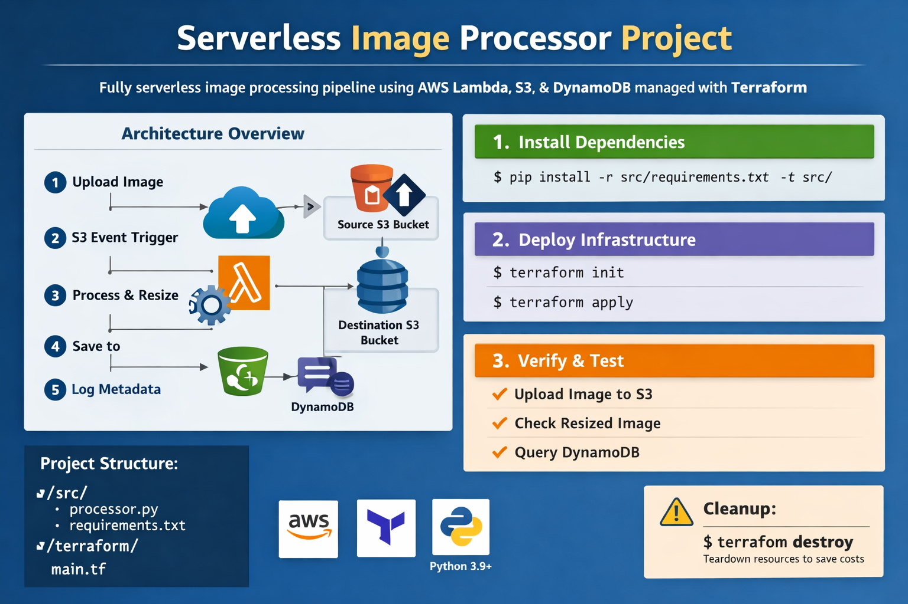

# Serverless Image Processor Project

This project deploys a fully serverless image processing pipeline using AWS Lambda, S3, and DynamoDB. Infrastructure is managed via Terraform.

## 🏗️ Architecture Diagram

<p align="center">
  
</p>


## Architecture

1.  **Upload**: User uploads an image to the *Source S3 Bucket*.
2.  **Trigger**: S3 Event notifies the Lambda function.
3.  **Process**: Lambda downloads the image, resizes it (creates a thumbnail), and extracts metadata.
4.  **Store**: Resized image is saved to the *Destination S3 Bucket*.
5.  **Record**: File metadata (size, path, timestamp) is logged in *DynamoDB*.

## Prerequisites

1.  **AWS CLI** installed and configured (`aws configure`).
2.  **Terraform** installed.
3.  **Python 3.9+** and `pip` installed.

## Setup & Deployment Guide

### 1. Prepare Dependencies
AWS Lambda needs the Python libraries (like Pillow) to be bundled with your code.
Run these commands from the project root:

```bash
# Install dependencies directly into the src folder
pip install -r src/requirements.txt -t src/
```

*Note: If you are on Windows, some libraries (like Pillow) might not work perfectly on AWS Lambda (which runs Linux) if you just copy them. For a production app, you'd use Docker. For this simple demo, it might work if a pure python wheel is available, otherwise, use the CloudShell method or a Docker build.*

### 2. Deploy Infrastructure
Initialize and apply the Terraform configuration.

```bash
cd terraform
terraform init
terraform apply
# Type 'yes' when prompted
```

### 3. Verification
Once deployed, Terraform will output the bucket names.

**Output Example:**
```
source_bucket_name = "serverless-img-proc-source-xxxx"
destination_bucket_name = "serverless-img-proc-dest-xxxx"
```

1.  **Upload an Image**:
    Upload a `.jpg` file to the source bucket.
    ```bash
    aws s3 cp path/to/my-image.jpg s3://YOUR_SOURCE_BUCKET_NAME/
    ```

2.  **Check Destination**:
    Wait a few seconds, then check the destination bucket.
    ```bash
    aws s3 ls s3://YOUR_DEST_BUCKET_NAME/
    ```

3.  **Check Database**:
    Scan the DynamoDB table to see the metadata.
    ```bash
    aws dynamodb scan --table-name serverless-img-proc-metadata
    ```

### 4. Cleanup
To avoid costs, destroy the resources when done.
```bash
terraform destroy
```
